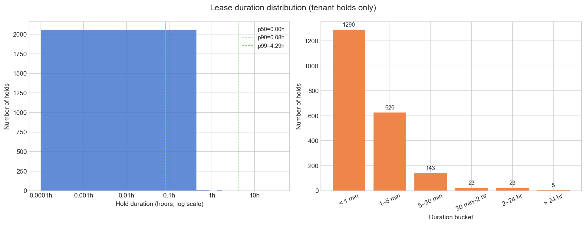
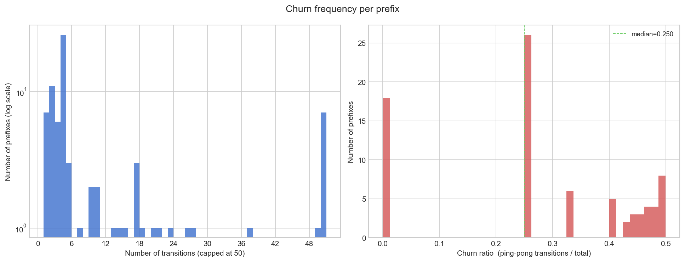
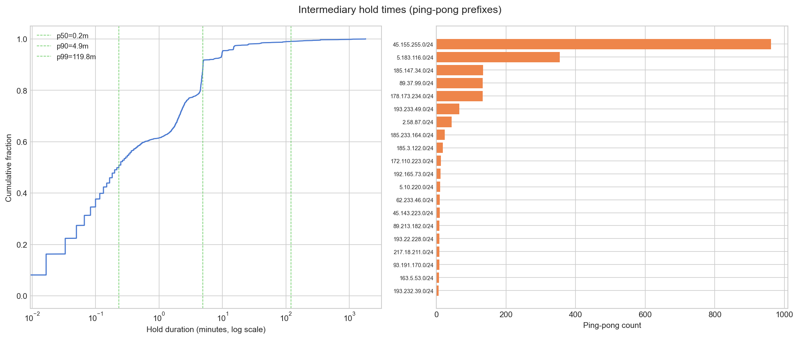
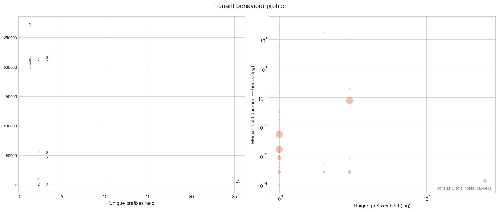
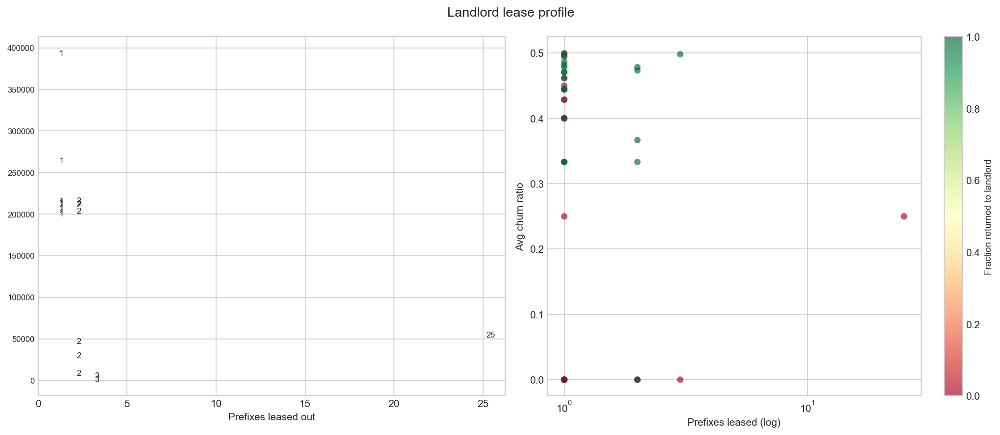

# Results: IP Leasing & BGP Churn Analysis

We analyzed the distribution and structure of inferred IP lease events using RIPE WHOIS registry data cross-referenced against BGP routing tables and AS relationship data from the CAIDA database. The methodology identifies prefixes where the BGP-originating AS has no organizational or business relationship to the RIPE-registered holder of the parent block, flagging these as inferred leases. Results are drawn from two inference groups and then fed into BGP churn analysis.

Prefix to AS data was from April 15 2026

AS organization data was from April 01 2026

---

## 1. RIPE Inference Results

### 1.1 Overall Scale

The RIPE inference pipeline identified **41,891 inferred leased prefixes** across the RIPE NCC service region. These are split across two detection groups:

| Group | Detection condition | Prefixes |
|---|---|---|
| Group 3 (c1) | Child prefix in BGP, parent block absent from BGP; originating AS unrelated to registered holder | 38,981 (93.1%) |
| Group 4 (c2) | Both child and parent in BGP; originating AS unrelated to both the registered holder and parent's BGP origin | 2,910 (6.9%) |

Group 3 dominates because the more common leasing pattern sees a lessor hold a large allocated block without announcing it themselves, while routing individual sub-blocks to tenants. Group 4 captures the stricter case where a parallel routing hierarchy exists and must be checked against both the registry and BGP dimensions.

Groups 1 & 2 were excluded as group on is IP adresses that are considered unused and Group 2 are IP adress ranges where a larger encompassing range of IP adresses has a BGP origin but not the range itself.

### 1.2 Prefix Size

The leased prefix market is overwhelmingly concentrated at **/24** granularity — the smallest standard routable block (256 addresses). Of the 41,891 inferred prefixes, **85.8% are /24s**. The remaining 14.2% include /22 and /23 blocks, with a small tail of larger aggregates down to /13.

This reflects market convention: /24s are the atomic unit of IP leasing because they are the most liquid, universally accepted by BGP filters, and difficult to de-aggregate further.

### 1.3 Registration Status

| Status | Count | Share |
|---|---|---|
| ASSIGNED PA | 36,027 | 86.0% |
| SUB-ALLOCATED PA | 5,864 | 14.0% |

The dominance of `ASSIGNED PA` prefixes confirms that most leases involve blocks that were originally assigned to an end-organization by their ISP (provider-aggregatable space), but have since been re-routed to an unrelated third party — the clearest signal of a lease.

### 1.4 Geographic Distribution

The top 15 countries by inferred leased prefix count are shown below. The US, Russia, and Germany together account for **33.3%** of all inferred leases.

| Country | Prefixes | Country | Prefixes |
|---|---|---|---|
| US | 6,251 | ES | 1,041 |
| RU | 4,247 | IT | 1,019 |
| DE | 3,469 | LT | 950 |
| GB | 2,698 | PL | 932 |
| NL | 2,492 | RO | 830 |
| EU | 1,407 | UA | 679 |
| FR | 1,300 | — | — |
| TR | 1,284 | — | — |
| SE | 1,271 | — | — |

The `EU` code in RIPE denotes pan-European allocations not tied to a specific member state. The concentration of Eastern European countries (RU, LT, UA, RO, PL) likely reflects both the density of the regional IP brokerage market and the prevalence of organizations that received allocations in the early internet era and are now monetizing excess space.

### 1.5 Top Lessors

The following organizations hold the largest number of inferred leased prefixes — i.e., they are registered as the parent block owner in RIPE but are not the actual routing party.

| Organization | Inferred leased prefixes |
|---|---|
| Internet Utilities Europe and Asia Limited | 2,021 |
| JSC "Ukrtelecom" | 1,252 |
| Cyber Assets FZCO | 1,158 |
| Resilans AB | 1,125 |
| DIAMOND IP BROKERS FZCO | 1,024 |
| TerraTransit AG | 867 |
| GOLD IP L.L.C-FZ | 669 |
| ANO RIPN (Russian Scientific-Research Institute) | 666 |
| ICI Bucuresti | 575 |
| Ace Data Centers II, LLC | 486 |

![Top3]
(RIPE_organizations.png)

Several of these (Cyber Assets FZCO, DIAMOND IP BROKERS FZCO, GOLD IP L.L.C-FZ, Resilans AB) are recognized IP brokers — entities whose primary business is acquiring and re-leasing address space. The presence of large legacy institutions (Ukrtelecom, ANO RIPN) reflects a different dynamic: organizations with historically large allocations from the early RIPE era that have monetized surplus space over time.

The Group 4 (c2) lessor profile differs notably, dominated by transit providers — GTT Communications, GCI Network Solutions — which delegate sub-blocks to customers under their own routing umbrella while the customer routes independently.

### 1.6 Market Growth Over Time

Registration creation dates show a sharp acceleration in inferred lease activity in recent years:

| Year | New leased prefixes registered |
|---|---|
| 2020 | 2,030 |
| 2021 | 2,028 |
| 2022 | 3,274 |
| 2023 | 3,753 |
| 2024 | 6,270 |
| 2025 | 10,748 |

From 2022 to 2025, inferred new leases grew by **228%**. This trend is consistent with the exhaustion of the RIPE free pool (reached in 2019) driving a secondary market where leasing becomes the primary mechanism for obtaining IPv4 space.

---

## 2. BGP Churn Analysis

The BGP event dataset contains 53,307 raw `LEASE_OR_HIJACK` events across 3,825 prefixes. After filtering to only prefixes confirmed by the RIPE inference methodology, **4,294 events across 109 validated prefixes** remain. Of those, 79 prefixes have enough consecutive distinct-tenant transitions to compute hold durations, yielding **4,185 hold periods** for analysis.

The 3,716 prefixes dropped by the RIPE filter (97.2% of the raw set) had BGP routing events that could not be confirmed as genuine leases — they may represent hijacks, misconfiguration, or legitimate customer routing relationships that passed AS relationship checks.

### 2.1 Lease Duration Distribution

Tenant hold durations are extremely short. The distribution is heavily concentrated at the sub-minute scale:

| Bucket | Hold periods | Share |
|---|---|---|
| < 1 min | 1,290 | 61.1% |
| 1–5 min | 626 | 29.7% |
| 5–30 min | 143 | 6.8% |
| 30 min–2 hr | 23 | 1.1% |
| 2–24 hr | 23 | 1.1% |
| > 24 hr | 5 | 0.2% |

Over **90% of all hold periods last under 5 minutes**. The percentile breakdown confirms this:

| Percentile | Seconds | Minutes |
|---|---|---|
| p25 | 3 s | 0.05 min |
| p50 | 14 s | 0.23 min |
| p75 | 157 s | 2.61 min |
| p90 | 297 s | 4.95 min |
| p95 | 718 s | 11.96 min |
| p99 | 15,457 s | 257.6 min |

The median hold of **14 seconds** is far shorter than any genuine infrastructure deployment would require, pointing to the validated events capturing rapid BGP origin cycling rather than stable leases. The heavy tail at p99 (4.3 hours) reflects the small fraction of prefixes held longer-term.

#### Lease Durations for Low-Churn Prefixes

To isolate stable leasing behaviour from automated cycling, the table below repeats the duration
breakdown restricted to the **50 prefixes with ≤ 4 transitions** (at or below the median churn count
from Section 2.2), covering 82 hold periods.

| Bucket | Hold periods | Share |
|---|---|---|
| < 1 min | 60 | 73.2% |
| 1–5 min | 2 | 2.4% |
| 5–30 min | 3 | 3.7% |
| 30 min–2 hr | 3 | 3.7% |
| 2–24 hr | 9 | 11.0% |
| > 24 hr | 5 | 6.1% |

| Percentile | Seconds | Minutes |
|---|---|---|
| p50 | 1.0 s | 0.02 min |
| p90 | 58,275.3 s | 971.26 min |
| p99 | 125,987.0 s | 2,099.78 min |

Notably, even in the low-churn subset the **< 1 min bucket still dominates at 73.2%**. This is likely explained by BGP convergence artifacts — brief withdrawals and re-announcements by the same tenant that the monitoring system records as hold-period boundaries rather than genuine tenant changes. With only 82 hold periods across 50 prefixes, a small number of such events heavily skews the lower end of the distribution. The tail, however, tells a different story: the p90 rises to **~16 hours** and the p99 to **~35 hours** — far longer than the p90 of 4.95 min and p99 of 257.6 min seen in the full dataset, which is itself dominated by high-churn prefixes. Genuinely stable leases exist in the validated set, but are rare and obscured by the automated cycling majority.

### 2.2 Churn Frequency per Prefix

The validated prefix set shows extreme churn. The mean transition count per prefix is **52.97**, but the median is only **4** — driven by a small number of highly active prefixes with hundreds or thousands of transitions. The most churned prefix (`45.155.255.0/24`) underwent **1,925 transitions** in the observation window.

The churn ratio — the fraction of a prefix's transitions that return to a previously-seen tenant — has a **median of 0.50 and mean of 0.51**, meaning that on average, half of all observed transitions are ping-pong repeats. **61 of 79 prefixes (77%)** exhibit at least one ping-pong event.

| Transitions | Prefixes | % of total | Avg churn ratio | % with ping-pong |
|---|---|---|---|---|
| 1 | 7 | 8.9% | 0.00 | 0.0% |
| 2 | 11 | 13.9% | 0.00 | 0.0% |
| 3–5 | 35 | 44.3% | 0.28 | 100.0% |
| 6–10 | 5 | 6.3% | 0.42 | 100.0% |
| 11–50 | 14 | 17.7% | 0.47 | 100.0% |
| 51+ | 7 | 8.9% | 0.50 | 100.0% |

Notably, all prefixes with 3 or more transitions exhibit at least one ping-pong event, and the churn ratio rises steadily with transition count — converging toward ~0.50 for the most active prefixes, consistent with a back-and-forth cycling pattern between two tenants.

### 2.3 Intermediary Hold Times

For the ping-pong prefixes, intermediary hold durations are even shorter than the overall distribution, confirming that repeated tenants acquire and release prefixes in rapid succession:

| Percentile | Duration |
|---|---|
| p50 | 0.23 min (14 s) |
| p90 | 4.93 min |
| p99 | 119.8 min |

The p50 of 14 seconds for intermediary holds strongly suggests automated BGP manipulation rather than any operational use of the address space. The top five most-churned prefixes are:

| Prefix | Transitions | Ping-pong count | Churn ratio | Avg hold (sec) |
|---|---|---|---|---|
| 45.155.255.0/24 | 1,925 | 962 | 0.500 | 113 |
| 5.183.116.0/24 | 710 | 354 | 0.499 | 9 |
| 185.147.34.0/24 | 269 | 134 | 0.498 | 543 |
| 89.37.99.0/24 | 267 | 133 | 0.498 | 546 |
| 178.173.234.0/24 | 267 | 133 | 0.498 | 548 |

### 2.4 Tenant Behaviour Profile

The dominant tenant by total hold count is **AS400395**, with 963 holds on a single prefix (`45.155.255.0/24`) and a median hold of just 20 seconds. **AS6079** remains the broadest tenant by prefix coverage, holding 25 unique prefixes with a median hold of 0.5 seconds — a profile consistent with automated BGP origin rotation. The next tier of tenants (AS213122, AS54454, AS215727) hold 3 prefixes each but with much longer median holds (288 s, 749 s, and 37,551 s respectively), suggesting a different use pattern — possibly legitimate short-to-medium term leases within the confirmed set.

| AS | Unique prefixes | Total holds | Median hold (sec) |
|---|---|---|---|
| AS6079 | 25 | 50 | 0.5 |
| AS213122 | 3 | 403 | 288 |
| AS54454 | 3 | 5 | 749 |
| AS215727 | 3 | 3 | 37,551 |
| AS48678 | 3 | 42 | 1 |

### 2.5 Landlord Profile

The top landlord by volume is **AS54339**, whose 25 leased prefixes have a mean churn ratio of **0.25** and a return rate of 0% — the prefixes never return to the landlord, consistent with a broker routing address space permanently outward. **AS931** holds 3 prefixes with a churn ratio of 0.498 and a 100% return rate, meaning prefixes cycle back to the landlord between every tenant transition. **AS5511** holds 3 prefixes with zero churn and zero returns — each prefix was handed to a single tenant and never came back, the cleanest long-term lease profile in the dataset.

| Landlord AS | Prefixes leased | Avg churn ratio | % returned |
|---|---|---|---|
| AS54339 | 25 | 0.250 | 0% |
| AS931 | 3 | 0.498 | 100% |
| AS5511 | 3 | 0.000 | 0% |
| AS8473 | 2 | 0.000 | 100% |
| AS215898 | 2 | 0.478 | 100% |

---

## Summary

The RIPE inference pipeline identified **41,891 leased prefixes**, concentrated at /24 granularity (85.8%), predominantly `ASSIGNED PA` status (86.0%), with the US, Russia, and Germany leading geographically. New lease registrations grew **228%** between 2022 and 2025, consistent with post-exhaustion IPv4 market dynamics.

BGP churn analysis on the 109 RIPE-validated prefixes reveals a striking pattern: **90.8% of hold periods last under 5 minutes**, with a median of just 14 seconds. The high ping-pong rate (77% of prefixes, median churn ratio 0.50) and sub-second intermediary holds on the most active prefixes point to automated BGP origin cycling as the dominant behavior in the confirmed lease set — distinct from the stable, longer-term leases that the RIPE registry data alone would suggest. However, the low-churn subset (prefixes with ≤ 4 transitions) reveals a contrasting population: p90 hold durations of ~16 hours and p99 of ~35 hours, confirming that stable, operationally genuine leases exist within the validated set but are a small minority obscured by the high-churn majority.

### Implications for Network Operators and Security Engineers

These findings have several practical consequences:

**For network operators**, the rapid growth of the secondary IPv4 market (228% since 2022) means that IP-to-organisation mappings in threat intelligence feeds and firewall allowlists are becoming less reliable. A /24 block assigned to a benign organisation in RIPE may be actively routed by an unrelated tenant. Operators should treat RIPE registration data as a necessary but not sufficient signal for trust decisions, and complement it with real-time BGP origin validation (e.g. RPKI ROAs).

**For security engineers**, the sub-second and sub-minute hold periods observed in the high-churn set (median 14 s, p90 < 5 min) are inconsistent with any legitimate infrastructure deployment lifecycle. This pattern, particularly in prefixes like `45.155.255.0/24` with 1,925 transitions and a churn ratio of 0.50, is a strong indicator of automated origin cycling, a technique used to evade IP-based blocklists and attribution. Detection systems that rely on static IP reputation scores will systematically fail against this class of behaviour; short-lived BGP event streams should be treated as a first-class signal for abuse triage.